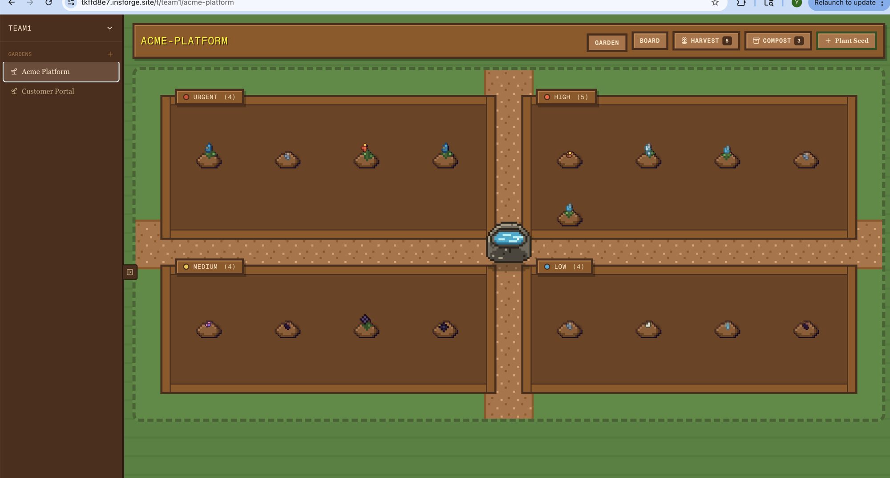
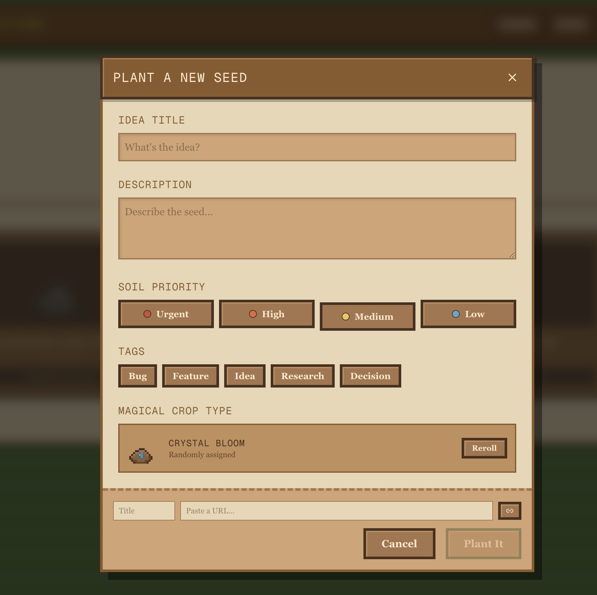
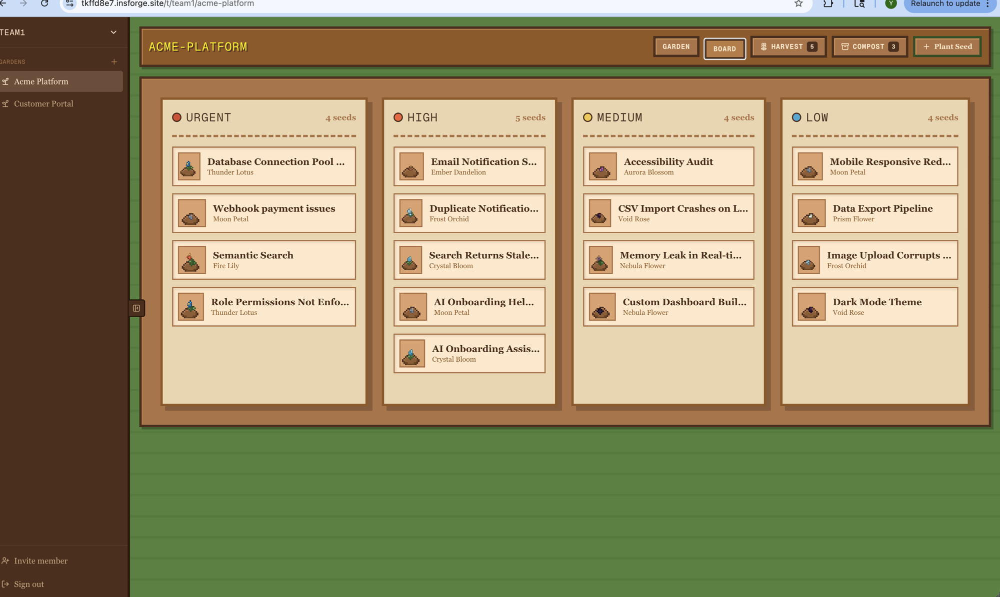
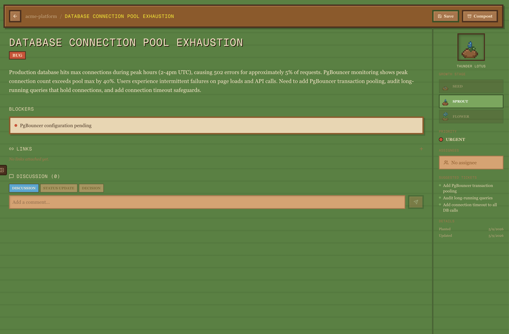
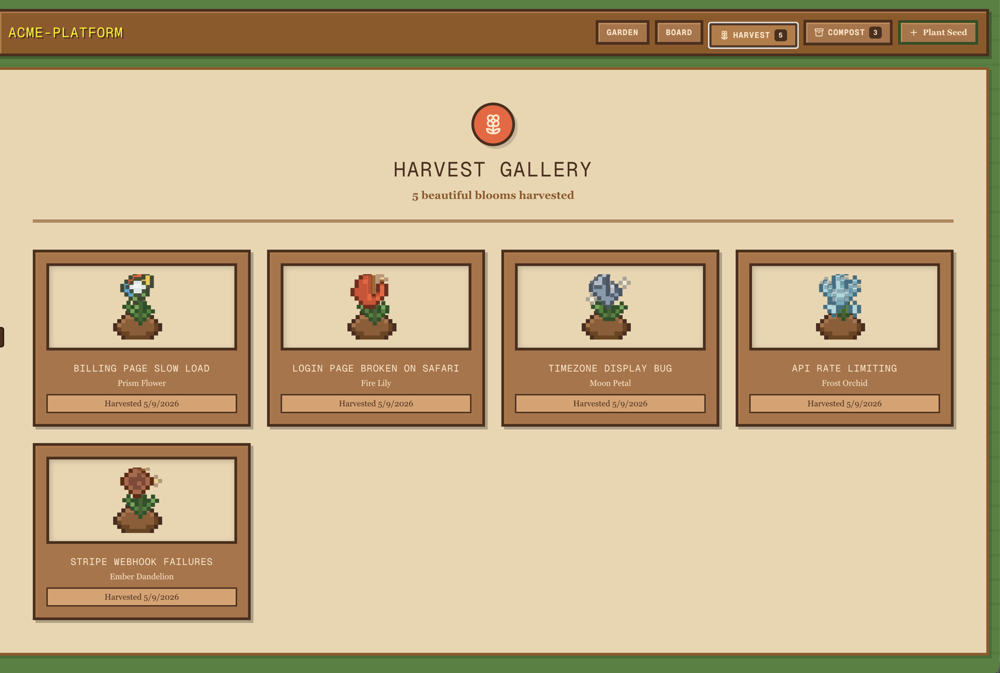
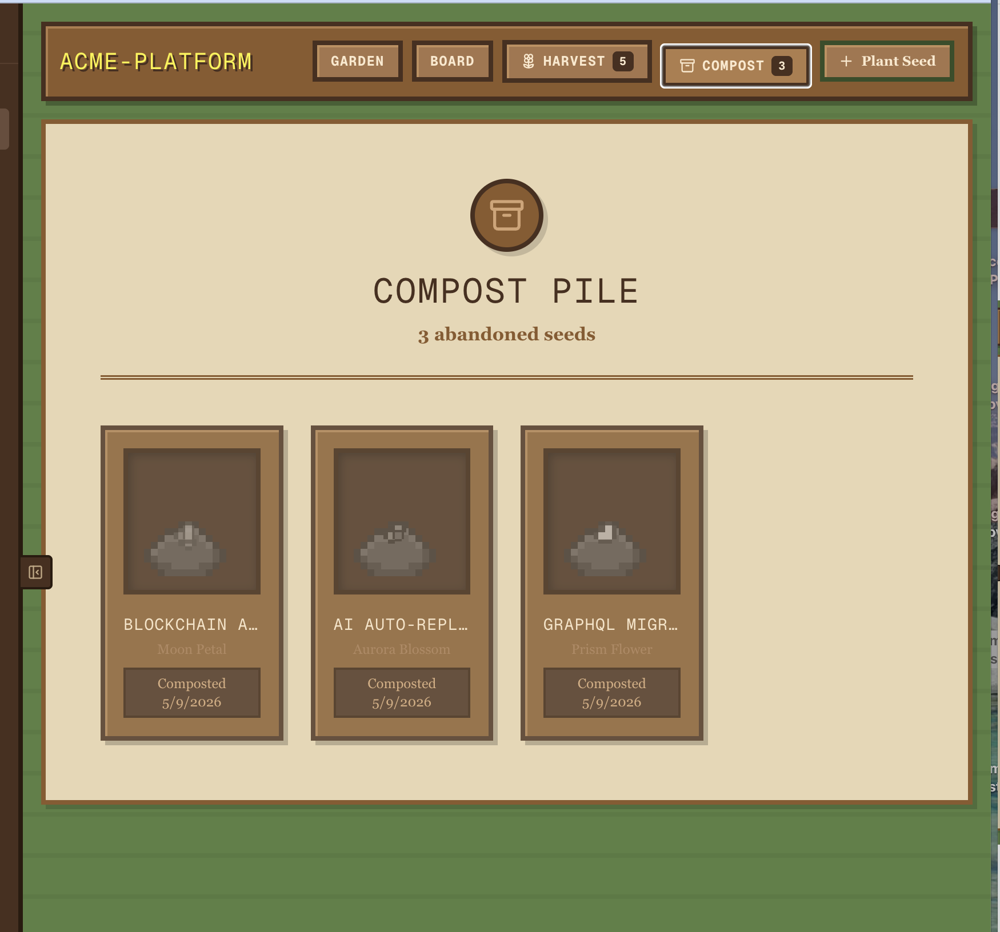
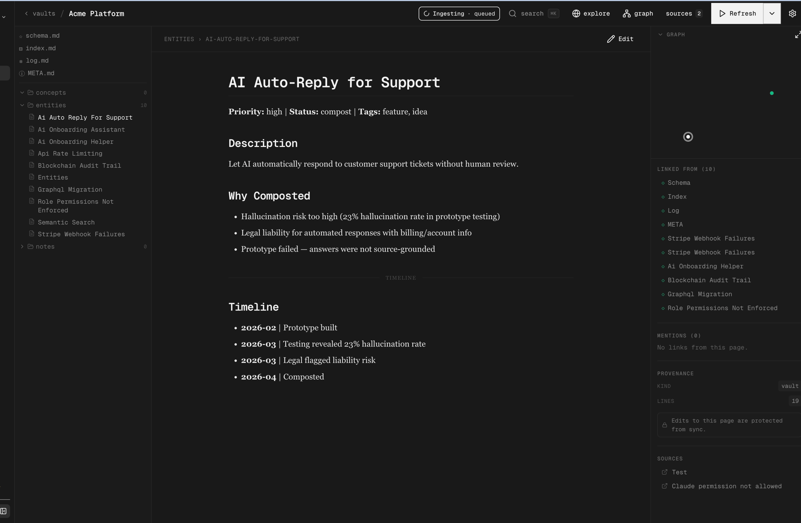
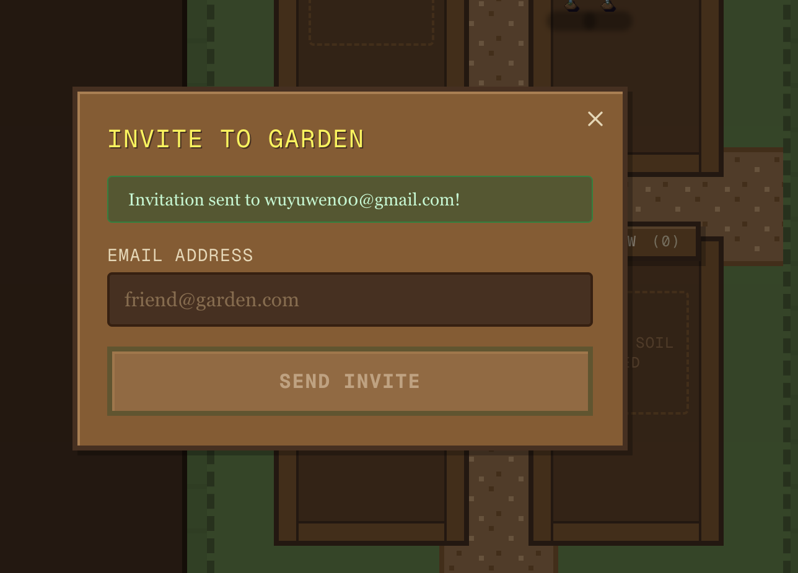
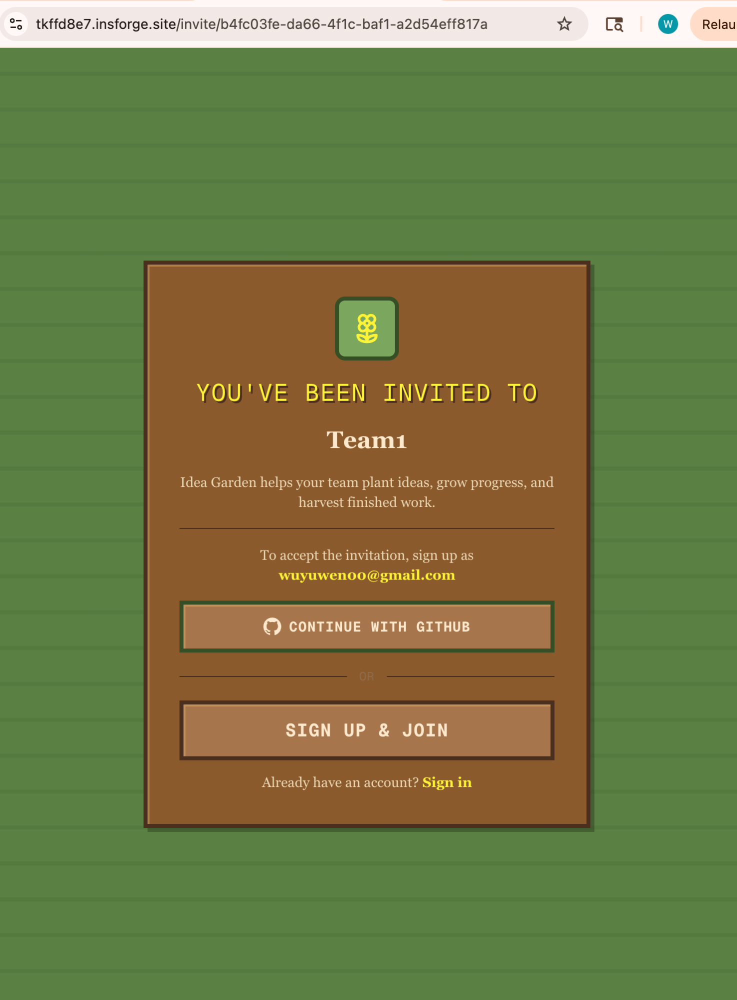
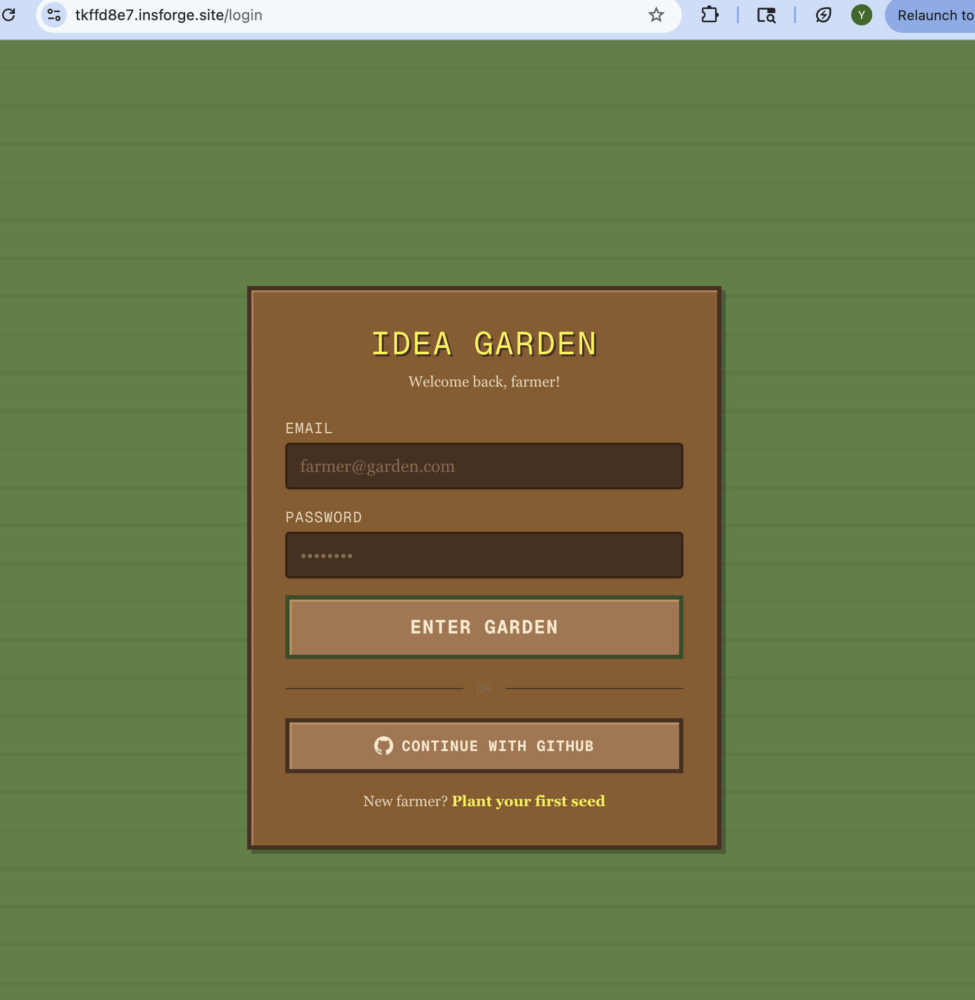

# Idea Garden

A Stardew Valley-inspired project tracker where ideas grow from seeds into blooms. Plant ideas, nurture them through stages, harvest completed work, and compost what doesn't make it — all in a cozy pixel-art garden.

**[Live Demo](https://tkffd8e7.insforge.site)**



## Features

### Plant & Grow Ideas

Each idea starts as a **seed**, grows into a **sprout**, blooms into a **flower**, and gets **harvested** when complete. Every seed is assigned a random magical crop type with pixel-art sprites that evolve as work progresses.



### Garden View

A 2D farm-style layout where seeds are planted in soil plots organized by priority — Urgent, High, Medium, and Low. Each plot shows your ideas as growing plants at a glance.

### Board View

A kanban-style priority board for when you need the traditional project management view. Seeds are grouped into Urgent, High, Medium, and Low columns with their crop sprites and names.



### Seed Detail

Click any seed to open a Linear-style detail view with description, blockers, links, tags, growth stage tracking, assignees, and AI-suggested related tickets. Threaded discussion supports Discussion, Status Update, and Decision comment types.



### Harvest Gallery

Completed ideas bloom into unique flowers and are displayed in the Harvest Gallery — a satisfying collection of everything your team has shipped.



### Compost Pile

Ideas that don't work out get composted with a reason. Compost reasons feed into the Nia knowledge base so the team can learn from past decisions.



### Nia Knowledge Base

Composted seeds, their reasons, and project history are synced to a structured knowledge base. Browse entities, view timelines, and understand why past decisions were made.



### Team Invites

Invite teammates via email. They receive a branded invitation email and land on a themed invite page to join your garden with GitHub OAuth or email signup.

<p align="center">
  
  
</p>


### Authentication

Email/password and GitHub OAuth login, styled to match the Stardew Valley theme.

<p align="center">
  
</p>

## Tech Stack

- **Framework** — Next.js (App Router)
- **UI** — Tailwind CSS, pixel-art sprites, Stardew Valley-inspired theme
- **Backend** — InsForge (auth, database, email, storage)
- **AI** — OpenAI (suggested tickets, knowledge base)
- **3D/2D** — React Three Fiber

## Getting Started

```bash
git clone https://github.com/wuyuwenj/idea-garden.git
cd idea-garden
npm install
```

Create a `.env.local` with your InsForge and OpenAI credentials:

```env
NEXT_PUBLIC_INSFORGE_URL=your-insforge-url
NEXT_PUBLIC_INSFORGE_ANON_KEY=your-anon-key
INSFORGE_SERVICE_ROLE_KEY=your-service-role-key
NEXT_PUBLIC_APP_URL=http://localhost:3000
OPENAI_API_KEY=your-openai-key
```

```bash
npm run dev
```

## Deploy

```bash
npx @insforge/cli deployments deploy .
```
